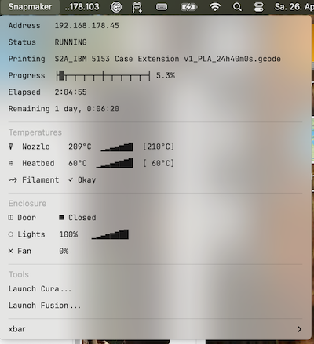

# xbar-snapmaker
Snapmaker Status Plugin for xbar (MacOS)
========================================

This script is a plugin for xbar and will display a Snapmaker menutitem 
on the MacOS Desktop screen.

The menuitem displays printing progress, temperatures and status of the Snapmaker
enclosure if installed.

It relies on Python, the below listed dependencies and uses the [JetBrains Mono](https://www.jetbrains.com/lp/mono/) font to display some symbols and block graphics.

Please make sure the below libraries are accessible in your python installation:

- import socket
- import requests
- import json
- import urllib3
- import ipaddress
- import time

Credits:
The status query part of this code is based on work by NiteCrwlr and his [playground repo](https://github.com/NiteCrwlr/playground/tree/main/SNStatus)